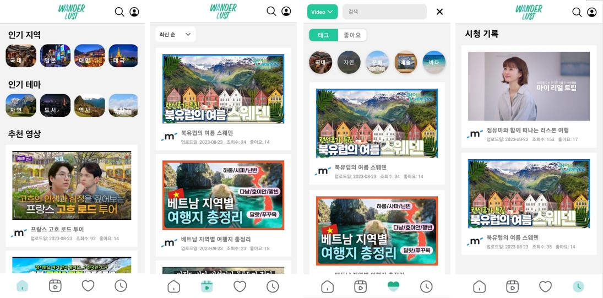
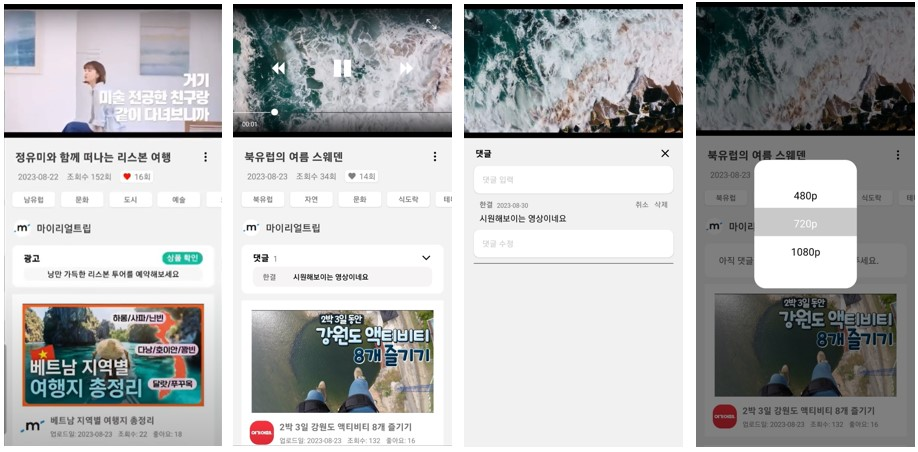
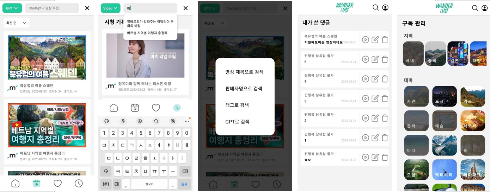
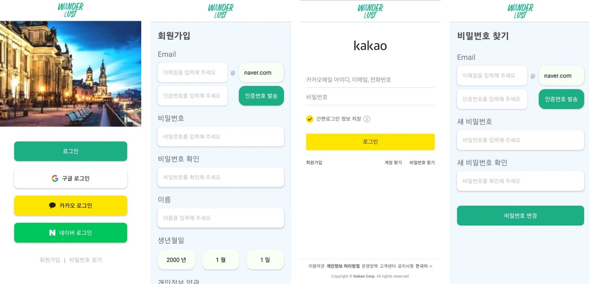

# T3_모앱협_클라우드 웹콘텐츠 서비스 개발


# **여행 비디오 커머스 플랫폼 *WANDERLUST***

<table>
<tr>
<td align="center">
  
### Front-End


</td>
<td align="center">
  
### Back-End


</td>

<td>

### UX·UI


</td>
</tr>
</table>


<hr/>

## 연계 기관 : 모바일 앱 협동 조합


- **기업 요구사항**
  ```
  - 클라우드 웹컨텐츠 서비스
    - 사용자 인증 기능 개발
    - 컨텐츠 등록 관리 기능 개발
    - 컨텐츠 스트리밍 기능 개발
  ```

- **Why, 여행 전문 비디오 커머스 플랫폼?**
  ```
  - 코로나 19 엔데믹 이후, 여행 수요 급증
  - 비디오 커머스 산업 급성장
  - 유튜버와 여행업체 협업 증가
  - 영상 조회수 대비 광고 판매 실적 저조
  ```

<hr/>

- **제안**
>  1. AI를 활용한 추천 여행 영상 제공
>  2. 사용 기록 기반 개인 추천 영상 제공
>  3. 구매 성사 기반의 광고 비즈니스 모델


- **해결 방안**
>  1. 영상 인코딩 및 CDN
>     - AWS CloudFron, S3
>     - FFMPEG, Video.js(React Native) 라이브러리
>  2. 사용자를 위한 개인화 영상 제공
>     - GPT API 활용, 자연어 기반 추천 영상 제공
>     - TF-IDF 알고리즘 활용 개인화 영상 제공
>  3. 판매자를 위한 통계 제공
>     - Chart.js 라이브러리 활용 데이터 시각화
>     - Redis 활용 통계 등록 중복 방지 구현
>  4. UX 향상을 위한 성능 개선
>     - 영상 인코딩 서버 분리 배포
>     - SockJS Stomp JS 활용 동영상 진행도 시각화

---

## Frontend
### CMS WEB UI 디자인
> 
> 
> 
> 
> 
> 
> 

### CMS Mobile UI 디자인
> #### Main
>  
>
> #### Video
>  
>
> #### Others (Search, Personal)
>  
>
> #### Login
>  
>
<hr/>

## Backend

### ERD
#### User Service
> 

#### Upload Service
> 

#### Personalized Service
> 

#### Statistics Service
> 

#### Comment Service
> 
> 
### 시스템 구조도
> 

<hr/>

### 배포 링크
> http://www.roberniro-projects.xyz/

### 유튜브 시연
> https://www.youtube.com/watch?v=EyDKypFDwgE

### 발표 자료
> https://drive.google.com/drive/folders/1bAkz9T9r50oekLjm5VMDQYYh0wHFJowW

